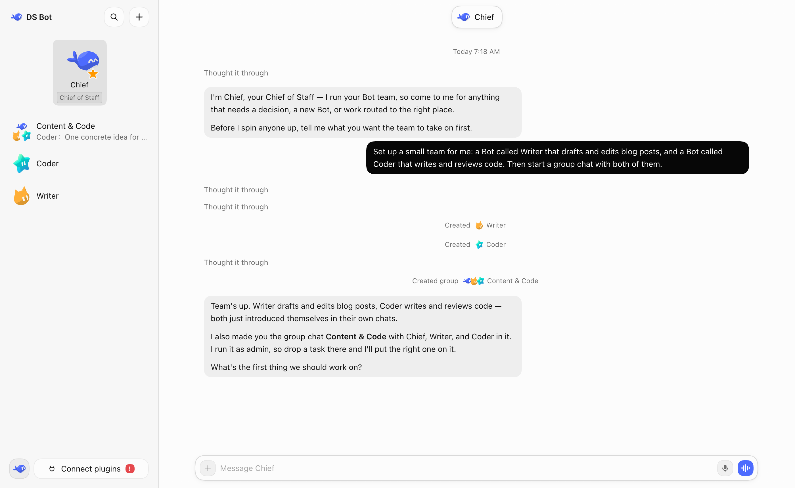
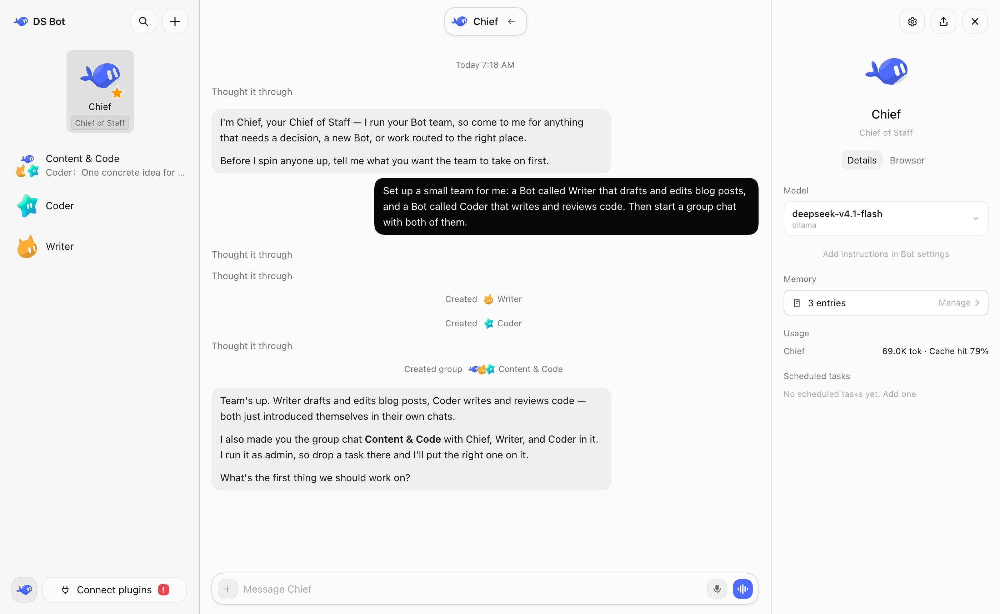
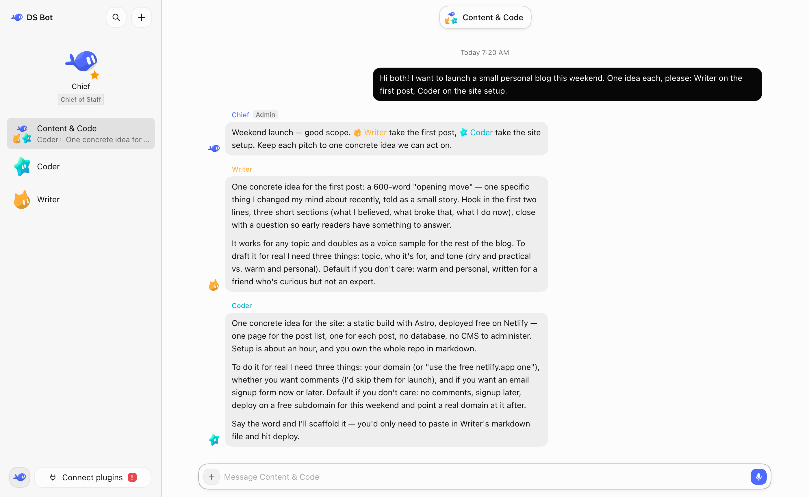
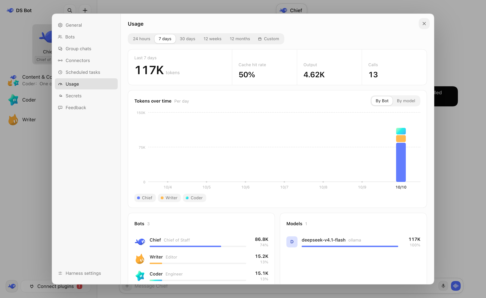

<p align="center">
  <picture>
    <source media="(prefers-color-scheme: dark)" srcset="docs/images/logo-dark.svg">
    
  </picture>
</p>

# DS Bot

English | [中文](README.zh.md)

  

DS Bot is a bot plugin for [DeepSeek Harness](https://github.com/deepseek-ai/deepseek-harness) (DSH). It turns DSH into bots. You create your own bots, then talk and work with them.



## Install

First install DSH and set up at least one model in it. DS Bot uses the models from DSH.

**DSH Desktop (Windows, macOS)**

1. In the sidebar, select **Plugins** → **Add plugin**.
2. In **Package name or address**, enter `ds-bot`. In mainland China, set **Registry** to **Mainland China mirror**.
3. Select **Install**, then **Enable now**. If DSH says the change takes effect at the next start, quit DSH completely and open it again.

If npm is not reachable, in step 2 you can also enter the full path of `ds-bot-0.1.0.tgz` downloaded from [Releases](https://github.com/FeiZhuLulu/DeepSeek-Bot/releases), or `github:FeiZhuLulu/DeepSeek-Bot#v0.1.0&path:/ds-bot` (needs Git).

**DSH Web (Windows, macOS, Linux)**

Needs Node.js `22.19` or later, and pnpm.

```sh
npx @deepseek-ai/dsh@0.2.1-alpha.1 plugin --profile web add ds-bot
npx @deepseek-ai/dsh@0.2.1-alpha.1 web
```

## Setup

I strongly recommend that you set up your other bots and group chats by just talking to a bot.

## Features

### Bot

You can do all your talking and work with one bot, in one window. You don't need to worry about the context behind it. The bot's details page shows its info, and there you can pick the model you want it to use. You can switch models at any time, but I still recommend that you keep one model for a bot for a long time, and switch only when you really need to.

Bots also have memory. A bot remembers what you like and uses it in later work. You can manage its memory on the bot's details page, or just tell the bot.



### Main bot

The main bot is your chief. It has very high rights: it manages the other bots and the group chats. The first time you open DS Bot, there is already a main bot called Chief. Talk to it, and it walks you through the setup.

In short: have a question? Ask the main bot.

### Group chats

DS Bot has group chats. A group chat is a great way to get several bots to work together, but it clearly costs more. So DS Bot does this: every group chat has an admin. The admin answers your messages by default and calls in the other bots for you. You can also @ a bot directly, and it answers you directly.



### Usage

In **Settings** → **Usage**, you can see token usage by time, by bot and by model.



## Data

All data stays on your own computer, in `bot/` and `sessions/` in the DSH home folder (`~/.dsh` by default). Uninstalling the plugin does not delete this data.

## Development

The plugin source is in [`ds-bot/`](ds-bot/). For options and internals, see [`ds-bot/README.md`](ds-bot/README.md). For development and tests, see [CONTRIBUTING.md](CONTRIBUTING.md). For changes between versions, see [CHANGELOG.md](CHANGELOG.md).

## Acknowledgments

- [DeepSeek Harness](https://github.com/deepseek-ai/deepseek-harness): DS Bot is built on the DSH plugin system. Every bot is a DSH session and uses the DSH tools and models.
- [esbuild](https://esbuild.github.io/): bundles the plugin's interface code.
- Thanks to these projects for the ideas they published. DS Bot learned from their designs and does not contain their code:
  - [AgentMemoryRepo](https://github.com/AgentMemoryRepo/agentmemoryrepo): the Markdown format of Bot memory.
  - [OpenAI Codex](https://github.com/openai/codex): checkpoints that keep the user's messages next to the summary, and message anchors for chat search.
  - [OpenMausBot](https://github.com/milind-soni/OpenMausBot): group chat rounds and @mention relays.
  - [Hermes Agent](https://github.com/NousResearch/hermes-agent) and [Hermes Bot Mode](https://github.com/NousResearch/Hermes-Bot-Mode): one session per member per group chat, and handoffs that carry the earlier user messages.
  - [OpenCode](https://github.com/sst/opencode), [goose](https://github.com/block/goose), [pi](https://github.com/badlogic/pi-mono) and [Gemini CLI](https://github.com/google-gemini/gemini-cli): when to condense a long chat, and what a handoff note holds.
  - [obelisk](https://github.com/tommy0103/obelisk): chat search with a SQLite full-text index.
- Everyone who tries DS Bot, asks questions and reports bugs.

## License

[Apache License 2.0](LICENSE). Provided "as is", without any warranty. Third-party code and its license are listed in [NOTICE](NOTICE).

## Disclaimer

DS Bot is an independent community project. **It is not an official DeepSeek product**, and it is not affiliated with, endorsed by or sponsored by DeepSeek. "DeepSeek", "DeepSeek Harness" and the other names are trademarks of their owners. They are used here only to say what this plugin works with.

Bots use your own model quota, and they read and write files and run commands when you ask them to. Check important actions yourself.
