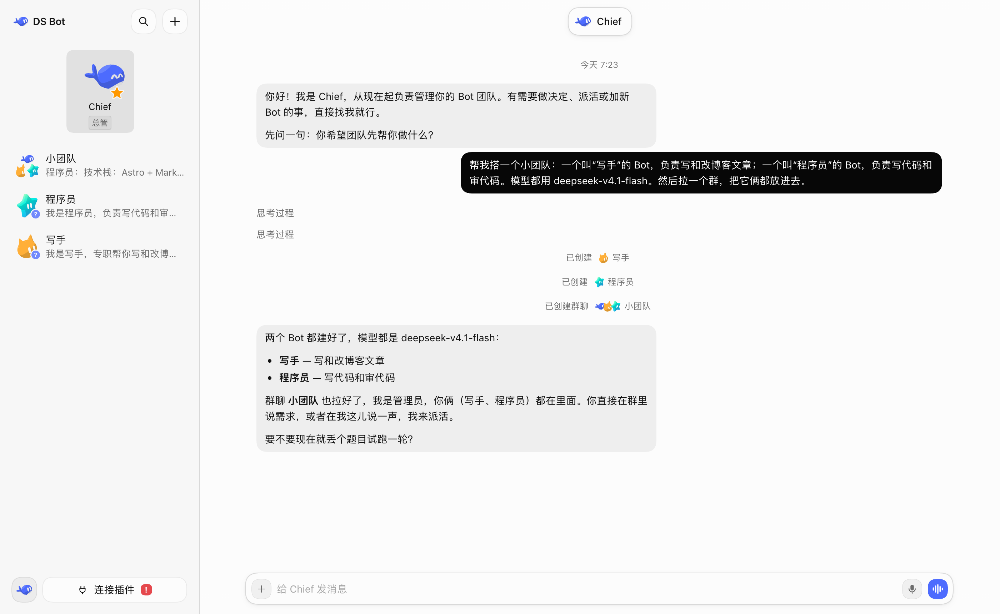
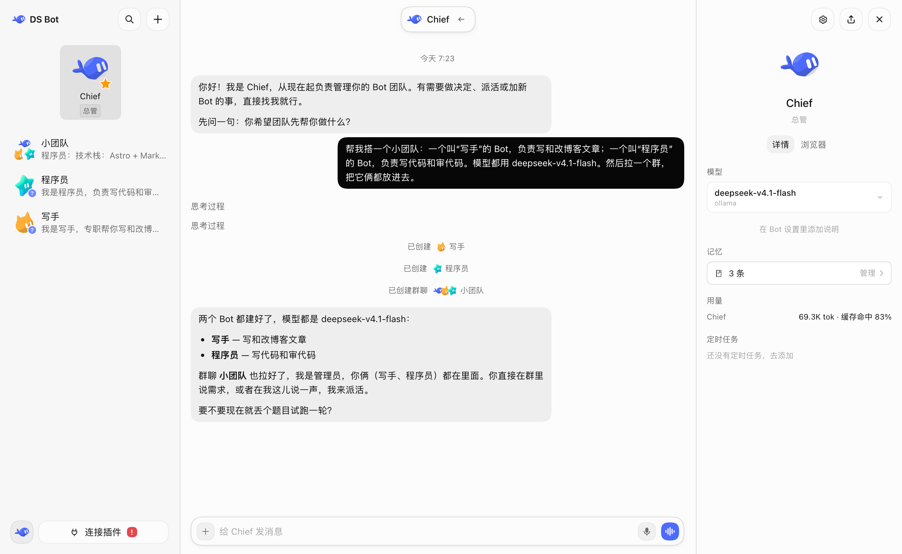
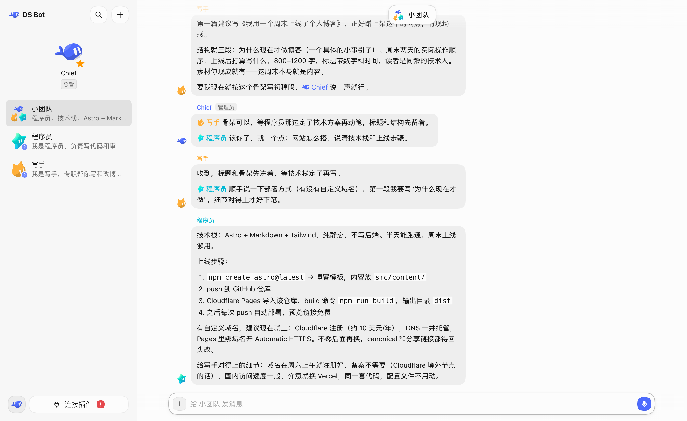
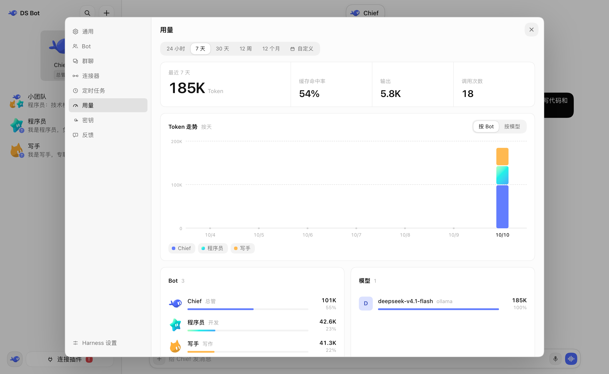

<p align="center">
  <picture>
    <source media="(prefers-color-scheme: dark)" srcset="docs/images/logo-dark.svg">
    
  </picture>
</p>

# DS Bot

[English](README.md) | 中文

  

DS Bot（后简称 ds bot）是一个基于 [DeepSeek Harness](https://github.com/deepseek-ai/deepseek-harness)（简称 dsh）的 bot 插件，插件将 dsh 改造为 bot 形式。你可以与自己创建的 bot 交流、工作。



## 安装

先装好 dsh，并在 dsh 里配好至少一个模型。ds bot 直接使用 dsh 里的模型。

**dsh Desktop（Windows、macOS）**

1. 侧栏点 **插件** → **添加插件**。
2. **包名或地址** 填 `ds-bot`。在中国大陆，**安装源** 选 **中国大陆镜像源**。
3. 点 **安装**，再点 **立即启用**。如果提示“下次启动生效”，完全退出 dsh 再打开。

连不上 npm 时，第 2 步也可以填 [Releases](https://github.com/FeiZhuLulu/DeepSeek-Bot/releases) 里下载的 `ds-bot-0.1.0.tgz` 的完整路径，或者 `github:FeiZhuLulu/DeepSeek-Bot#v0.1.0&path:/ds-bot`（需要装 Git）。

**dsh Web（Windows、macOS、Linux）**

需要 Node.js `22.19` 以上和 pnpm。

```sh
npx @deepseek-ai/dsh@0.2.1-alpha.1 plugin --profile web add ds-bot
npx @deepseek-ai/dsh@0.2.1-alpha.1 web
```

## 配置

我强烈建议你直接通过和 bot 对话来配置其他 bot 和群聊。

## 功能

### Bot

你可以在一个窗口中和一个 bot 完成所有对话和工作，你无需担心背后的上下文问题。你可以在 bot 详情页查看 bot 信息，也可以为 bot 选择你想使用的模型。你可以随时切换模型，但我仍然建议你为一个 bot 长期保持一个模型，仅在真正必要的时刻切换。

另外，bot 拥有记忆，它会记住你的喜好并在下次的工作中应用。你可以在 bot 的详情页管理记忆，也可以直接和 bot 对话来进行管理。



### Main bot

这个 bot 作为你的 chief，它拥有非常高的权限，可以管理其他 bot 和群聊。第一次进入 ds bot 时，默认会有一个 main bot 叫 Chief。你可以直接和它对话，让它引导你完成配置。

总之，有问题，找 main bot。

### 群聊

ds bot 拥有群聊功能。群聊是非常好的多 bot 协作方式，但它会带来非常明显的费用问题。ds bot 为此特意做了优化：在一个群聊中，你需要设置一个管理员。你的消息默认由管理员回复，它会帮你调用其他 bot。你也可以直接 @ 你需要沟通的 bot，它会直接回应你。



### 用量

在 设置 → 用量 里，可以按时间、按 bot、按模型查看 Token 用量。



## 数据

所有数据都在你自己的电脑上，在 dsh 主目录（默认 `~/.dsh`）的 `bot/` 和 `sessions/` 里。卸载插件不会删除这些数据。

## 开发

插件源码在 [`ds-bot/`](ds-bot/)。配置项和内部结构见 [`ds-bot/README.md`](ds-bot/README.md)，开发和测试见 [CONTRIBUTING.md](CONTRIBUTING.md)，版本变化见 [CHANGELOG.md](CHANGELOG.md)。

## 致谢

- [DeepSeek Harness](https://github.com/deepseek-ai/deepseek-harness)：ds bot 建在 dsh 的插件系统上。每个 bot 都是一个 dsh 会话，用的是 dsh 的工具和模型。
- [esbuild](https://esbuild.github.io/)：用来打包插件的界面代码。
- 感谢下面这些项目公开的设计思路。ds bot 参考了它们的思路，没有使用它们的代码：
  - [AgentMemoryRepo](https://github.com/AgentMemoryRepo/agentmemoryrepo)：bot 记忆的 Markdown 格式。
  - [OpenAI Codex](https://github.com/openai/codex)：压缩时把用户原话留在摘要旁边，以及搜索聊天记录用的消息锚点。
  - [OpenMausBot](https://github.com/milind-soni/OpenMausBot)：群聊轮流发言和 @ 接力。
  - [Hermes Agent](https://github.com/NousResearch/hermes-agent) 和 [Hermes Bot Mode](https://github.com/NousResearch/Hermes-Bot-Mode)：每个成员在每个群里一个会话，以及交接时带上用户之前的原话。
  - [OpenCode](https://github.com/sst/opencode)、[goose](https://github.com/block/goose)、[pi](https://github.com/badlogic/pi-mono)、[Gemini CLI](https://github.com/google-gemini/gemini-cli)：长对话什么时候压缩，交接笔记写哪些内容。
  - [obelisk](https://github.com/tommy0103/obelisk)：用 SQLite 全文索引搜索聊天记录。
- 每一位试用 ds bot、提问题、报 bug 的人。

## 许可

[Apache License 2.0](LICENSE)。按“原样”提供，不附带任何担保。用到的第三方代码和它的许可见 [NOTICE](NOTICE)。

## 声明

ds bot 是独立的社区项目，**不是 DeepSeek 官方产品**，与 DeepSeek 没有隶属、认可或赞助关系。“DeepSeek”“DeepSeek Harness”等名称是各自所有者的商标，这里只用来说明本插件和什么一起用。

bot 会消耗你自己的模型额度，也会按你的要求读写文件、运行命令。重要的操作请自己检查。
